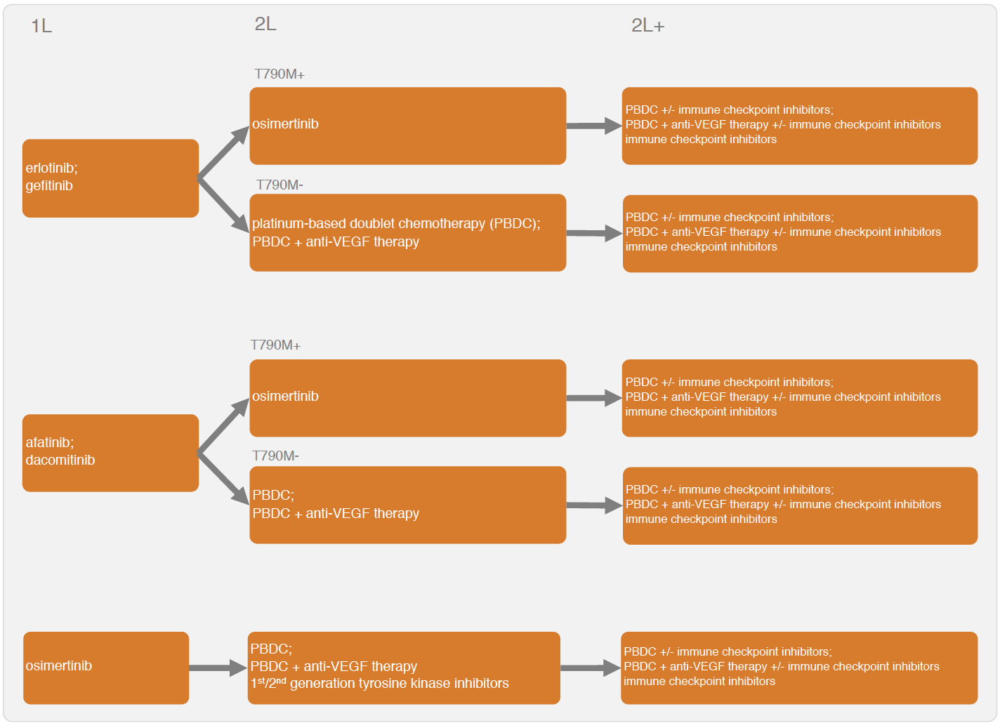
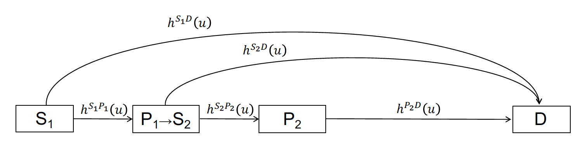
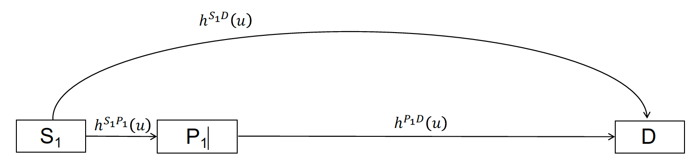

# Overview
The IVI-NSCLC model simulates disease progression for different sequential treatment strategies using a continuous time state transition model (CTSTM) for patients with epidermal growth factor receptor (EGFR) positive NSCLC. Treatment sequences that can be modeled are shown in the figure below. Tyrosine kinase inhibitors (TKIs) can be used at first line. Possible second line treatments (2L) and treatments beyond second line (2L+) depend on whether a patient acquired a T790M mutation.

<br>
<br>
```{r, out.width = "800px", echo = FALSE}

``` 
<br>
<br>

Sequential treatment can be incorporated into the CTSTM by expanding the number of health states according to the number of treatment lines. In general, one can define a health state for each treatment line, a health state after progression on the final line, and a death state, so a model with n treatment lines will have n+2 health states. A patient with stable disease moves to the second treatment in a sequence after progression on the first treatment, to the third treatment after progression on the second treatment, and so on. A patient can die at any time. Unfortunately, the evidence base is currently too limited to explicitly model the transition rates by line of treatment and a simplified model structure is needed. Two options are available with the IVI-NSCLC model: a four-state model and a three-state model. We prefer the four-state CTSTM because it explicitly models 2L treatments; however, there is no 2L evidence following some 1L treatments (i.e., osimertinib), so a three-state model may be preferred in these cases. 

In the four-state model, patients begin 1L treatment in stable disease (S1) and can either transition to the progression state (P1) or death (D). At progression, patients move to the progression-free (stable) state (S2) with 2L treatment and can again either have their disease progress (P3) or die. At P3, patients begin 2L+ treatment and remain in the progressed state until death. Time-varying hazard rates for transitions between states $r$ and $s$ and are denoted by $h^{rs}(u)$. 

<br>
```{r, out.width = "800px", echo = FALSE}

```
<br>
<br>

In the three-state model, all hazard rates are based on 1L clinical trial evidence. Patients begin in stable disease (S1) and they can transition to the progression state (P1) or death (D).

<br>
```{r, out.width = "800px", echo = FALSE}

```
<br>
<br>

The three and four-state model structures are used to construct an economic model that consists of three primary submodels: (i) a disease progression model (i.e., transition model) that determines transitions between health states, (ii) a utility model that simulates the health-state utility of each health state, and (iii) a set of cost models that simulates the costs associated with multiple cost categories (i.e., drug acquisition and administration costs, inpatient medical costs, outpatient medical costs, adverse event costs, and productivity losses). The economic model simulates relevant outcomes of interest including the probabilities of being in each of the health states over time, quality-adjusted life-years (QALYs), and costs by category. Probabilistic sensitivity analysis (PSA) is used to propagate uncertainty in the model input parameters throughout the model.

Two R packages are needed to simulate the model: the `iviNSCLC` and [hesim](https://innovationvalueinitiative.github.io/hesim/) packages. We will also use [ggplot2](https://ggplot2.tidyverse.org/), [gridExtra](https://cran.r-project.org/web/packages/gridExtra/index.html), and [scales](https://scales.r-lib.org/) for plotting, [knitr](https://rmarkdown.rstudio.com/lesson-7.html) to create tables, and [data.table](https://github.com/Rdatatable/data.table/wiki) to manipulate data and simulation output.

```{r, message=FALSE, warning=FALSE}
library("iviNSCLC")
library("hesim")
library("data.table")
library("ggplot2")
library("gridExtra")
library("scales")
library("knitr")
ggplot2::theme_set(theme_minimal())
```

# Parameter estimates
A number of different statistical models are used to parameterize the economic model. First, Bayesian network meta-analyses (NMAs) were conducted to parameterize multi-state statistical models for the health-state transitions and the probability of grade 3/4 adverse events. Second, estimates from the literature were used to characterize probability distributions of utility and each cost category. The parameter estimates, which load with the `iviNSCLC` package, are as follows:

* [`params_mstate_nma`](../reference/params_mstate_nma.html): The posterior distribution for the parameters of the Bayesian multi-state NMA.
* [`params_ae_nma`](../reference/params_ae_nma.html): The posterior distribution for the parameters of the Bayesian NMA of adverse events. Estimated using a binomial model with a logit link.
* [`params_utility`](../reference/params_utility.html): The probability distribution of the health state utility associated with each health state (S1, P1, and P2).
* [`params_costs_tx`](../reference/params_costs_tx.html): The drug acquisition and administration costs for each treatment. 
* [`params_costs_inpt`](../reference/params_costs_inpt.html): Inpatient medical costs by health state (S1, P1, and P2).
* [`params_costs_op`](../reference/params_costs_op.html): Outpatient medical costs by health state (S1, P1, and P2).
* [`params_costs_ae`](../reference/params_costs_ae.html): The costs associated with each of the adverse events from the NMA. 
* [`params_costs_prod`](../reference/params_costs_prod.html): Productivity costs including costs from temporary disability, permanent disability, and premature mortality. 

# Economic model
We provide an example a four-state model for 1L treatment, while also showing how a three-state model could be specified. Importantly, different modeling approaches are used for the three-state and four-state approaches. Since a "clock-forward" multi-state NMA was conducted separately by line of treatment, the four-state model is a mixture of clock-forward and "clock-reset" models. In the clock-reset approach, time $u$ in $h^{rs}(u)$ resets after each transition whereas in the clock-forward approach time $u$ refers to time since the start of the model (see the tutorial [here](https://onlinelibrary.wiley.com/doi/abs/10.1002/sim.2712) for a more detailed discussion). In the four-state model, the clock resets when entering state S1. Conversely, in the three-state model (either starting at 1L or 2L), the transition rates are always estimated using a NMA of treatments within a single line, so a clock-forward multi-state model must be used. 

An individual-level simulation is required to simulate clock-reset and mixtures of clock-forward and clock-reset models, and can also be used to simulate clock-forward models. The individual-level model is simulated in R using the `IndivCtstm` class from the [hesim](https://innovationvalueinitiative.github.io/hesim/) package.

## Set up
### Patient population
The first step in the analysis is to define the target population. In the individual-level model, a sufficient number of patients must be simulated so that expected (i.e., mean) outcomes are stable across simulations. In this example, we simulate 1,000 patients.

```{r}
pats <- create_patients(n = 1000)
```

### Treatment sequences
Since T790M mutation status is unknown in the 1L four-state case, a treatment sequence consists of a 1L treatment and treatment options for both the T790M+ and T790M- cases at 2L and 2L+. Multiple treatment sequences are combined into a "txseq_list" object using `txseq_list()`. We specify that the model begins at first line treatment with the argument `start_line = "first"` at which time the T790M mutation status is unknown; however, note that the evidence base is currently too limited to reliably simulate disease progression when starting at second line. 

```{r}
txseq1 <- txseq(first = "gefitinib",
                second = c("osimertinib", "PBDC"),
                second_plus = c("PBDC + bevacizumab", "PBDC + bevacizumab"))
txseq2 <- txseq(first = "erlotinib",
                second = c("osimertinib", "PBDC"),
                second_plus = c("PBDC + bevacizumab", "PBDC + bevacizumab"))
txseqs <- txseq_list("Sequence 1" = txseq1, "Sequence 2" = txseq2,
                     start_line = "first",
                     mutation = "unknown")
```

It is also useful to write a short convenience function for creating informative names for treatment strategies (i.e., treatment sequences), which can be used for plotting.

```{r}
# Convenience function to add factor names to data table
# for plotting
strategy_factor <- function(x, rev = FALSE){ 
  strategy_names <- names(txseqs)
  if (rev == FALSE){
    x[, strategy_name := factor(strategy_id, levels = 1:length(txseqs), 
                               labels = strategy_names)]
  } else{
    x[, strategy_name := factor(strategy_id, levels = rev(1:length(txseqs)), 
                                 labels = rev(strategy_names))]
  }
}
```

### Model structure
A model structure is specified with `model_structure()`. The survival distribution used to estimate the multi-state NMA and model transitions between health states is specified using the `dist` argument. A description of the relevant health states can be generated using `create_states()` and possible health state transitions are stored in a transition matrix generated using `create_trans_mat()`.

```{r}
struct <- model_structure(txseqs, dist = "weibull", n_states = "three")

# Health states
states <- create_states(struct)
print(states)

# Transition matrix
tmat <- create_trans_mat(struct)
print(tmat)
```

We could have also specified a three-state model.

```{r}
struct_3 <- model_structure(txseqs, dist = "weibull",
                            n_states = "three")
print(create_states(struct_3))
print(create_trans_mat(struct_3))
```

Recall that the transition matrix depends on the model structure.

```{r}
tmat_3 <- create_trans_mat(struct_3)
print(tmat_3)
```

As with treatment strategies, its useful to write a convenience function for generating informative names for health states for plotting.

```{r}
state_factor <- function(x, rev = FALSE){ 
  state_names <- states$state_name
  if (rev == FALSE){
    x[, state_name := factor(state_id, levels = 1:nrow(states), 
                            labels = state_names)]
  } else{
    x[, state_name := factor(state_id, levels = rev(1:nrow(states)), 
                            labels = rev(state_names))]
  }  
}
```

## Constructing the model
We construct the economic model by combining the separate models for the health state transitions, utility, and costs.

```{r}
n_samples <- 1000
```

### Health state transition model
Health state transitions are simulated as a function of input data (which contains the covariates from the multi-state model describing differences in transition rates across treatments) and parameters (the coefficients from the multi-state NMA). These are automatically created as a function of the model structure, transition matrix, and patient population with `create_transmod_data()` and stored below in a data table named `transmod_data`. A fraction of patients are T790M mutation positive. Coefficients from the multi-state NMA that are contained in `transmod_data` are extracted using `transmod_params()`. 

Recall from the discussion above that an individual-level model is required to simulate a CTSTM that that is a mixture of clock-reset and clock-forward approaches. The `create_transmod()` function constructs an individual-level CTSTM (iCTSTM) to model health state transitions (i.e., it returns a `hesim` object of class  `IndivCtstmTrans`).  

```{r}
# Input data
transmod_data <- create_transmod_data(struct, tmat, pats)
## Print first 5 rows and and 10 covariates from data
print(transmod_data[1:5, 1:10]) 

# Parameters
transmod_params <- create_transmod_params(n = n_samples, data = transmod_data)
## Print first 5 samples from the probability distribution and 4 covariates (which
## match those in 'transmod_data')
transmod_params$coefs$a0[1:5, 1:4]

# Health state transition model
transmod <- create_transmod(params = transmod_params, data = transmod_data)
class(transmod)
```

### Adverse events
Adverse events are assumed to occur during the first month of treatment and cause a decrease in utility and an increase in costs. Adverse event probabilities in the model are consequently based on the first treatment in a treatment sequence. We obtain these probabilities from the posterior distributions stored in `params_ae_nma` using the `ae_probs()` function. 
```{r ae_probs, fig.height = 4}
ae_probs <- ae_probs(n_samples, struct)
```

### Utility and cost models
We construct a "mean" model for utility. During the first month, utility varies across both treatment strategies and health states because adverse event probabilities vary across treatments; after the first month, utility varies across health states, but it assumed constant across treatments since adverse events no longer occur.

```{r}
utilmod <- create_utilmod(n = n_samples, struct = struct, patients = pats,
                          ae_probs = ae_probs)
```

We also construct models for each cost category.

```{r}
costmods <- create_costmods(n = n_samples, struct = struct, patients = pats, ae_probs = ae_probs)
```

### Combining the models
Now that the transition, utility, and cost models have been constructed, they can be combined to construct the complete economic model. We use the `IndivCtstm` class from `hesim`, and instantiate an iCTSTM.   

```{r}
econmod <- hesim::IndivCtstm$new(trans_model = transmod,
                                 utility_model = utilmod,
                                 cost_models = costmods)
```

## Simulation
### Disease progression
The iCTSTM is used to simulate disease progression, QALYs, and costs. We begin by simulating disease progression with `$sim_disease()` and set the time horizon to 20 years. Since the NMA measured time in months, we convert simulated months to years for the economic model.

```{r}
max_yrs <- 20
max_age <- 100
econmod$sim_disease(max_t = max_yrs * 12, max_age = max_age * 12)
econmod$disprog_[, ':=' (time_start = time_start/12, time_stop = time_stop/12)]
```

We then compute the probability that a patient is in each of the four health states as a function of time and plot mean state probabilities (averaged across the joint probability distribution of the parameters). 

```{r stateprobs}
econmod$sim_stateprobs(t = seq(0, 20 , 1/26)) # Biweekly probabilities

# Plot of state probabilities
stprobs <- econmod$stateprobs_[, .(prob_mean = mean(prob),
                                     prob_lower = quantile(prob, .025),
                                     prob_upper = quantile(prob, .975)),
                                 by = c("strategy_id", "state_id", "t")]
state_factor(stprobs)
strategy_factor(stprobs)
ggplot(stprobs[t < 15], aes(x = t, y = prob_mean, col = strategy_name)) +
  geom_line() + facet_wrap(~state_name) + 
  xlab("Years") + ylab("Probability in health state") +
  scale_color_discrete(name = "") +
  theme(legend.position = "bottom")
```

Since [progression-free survival](https://en.wikipedia.org/wiki/Progression-free_survival) and [overall survival](https://www.cancer.gov/publications/dictionaries/cancer-terms/def/overall-survival) are the most commonly reported primary endpoints in clinical trials, they are also useful to compute. We measure PFS as time with stable disease and OS as time before death.

```{r pfs_os_curves}
death_state <- switch(struct$n_states,
                      "three" = 3,
                      "four" = 4)
curves <- econmod$stateprobs_[state_id == 1 | state_id == death_state]
curves[, prob := ifelse(state_id == death_state, 1 - prob, prob)] # OS is 1 - pr(death)
curves[, lab := factor(state_id, levels = c(1, death_state), labels = c("PFS", "OS"))]
curves <- curves[, .(prob_mean = mean(prob),
                            prob_lower = quantile(prob, .025),
                            prob_upper = quantile(prob, .975)),
                          by = c("strategy_id", "lab", "t")]
strategy_factor(curves)
ggplot(curves[t < 15], aes(x = t, y = prob_mean, col = strategy_name)) +
  geom_line() + facet_wrap(~lab, scales = "free_x") + 
  xlab("Years") + ylab("Survival probability") +
  scale_color_discrete(name = "") + 
  theme(legend.position = "bottom")
```

We can also summarize quantiles of the PFS and OS curves. Here, we plot the median of (mean) PFS and OS. 

```{r pfs_os_quantiles, fig.height = 3}
quantiles <- hesim::surv_quantile(curves, probs = c(.025, .25, .5, .75, .975),
                                  t = "t",
                                  surv_cols = c("prob_mean", "prob_lower", "prob_upper"),
                                  by = c("strategy_id", "lab"))
strategy_factor(quantiles, rev = TRUE)
ggplot(quantiles[prob == .5], aes(x = strategy_name, y = quantile_prob_mean)) + 
  facet_wrap(~lab, nrow = 2) +
  geom_bar(stat = "identity", fill = "#d9230f") +
  geom_errorbar(aes(ymin = quantile_prob_lower,
                    ymax = quantile_prob_upper), width = .2) +
  scale_fill_discrete(name = "") +
  xlab("") + ylab("Median years") +
  coord_flip() 
```


### Adverse events
The `tidy.ae_probs()` function can be used to convert an `ae_probs` object into a tidy `data.table` suitable for plotting. We do that here to compare adverse event probabilities across treatment strategies.

```{r ae_probs_plot, fig.height = 6.5}
tidy_ae_probs <- tidy(ae_probs)
plot_data <- tidy_ae_probs[, .(prob_mean = mean(prob),
                               prob_lower = quantile(prob, .025),
                                prob_upper = quantile(prob, .975)),
                          by = c("strategy_id", "ae_name")]
strategy_factor(plot_data, rev = TRUE)
plot_data[, ae_name := ifelse(ae_name == "Elevated alanine transaminase",
                              "Elevated \n alanine \n transaminase",
                              ae_name)]
plot_data[, ae_name := ifelse(ae_name == "Elevated aspartate transaminase",
                              "Elevated \n aspartate \n transaminase",
                              ae_name)]
ggplot(plot_data, aes(x = strategy_name, y = prob_mean)) + 
  facet_wrap(~factor(ae_name), ncol = 3) +
  geom_bar(stat = "identity", fill = "#d9230f") +
  geom_errorbar(aes(ymin = prob_lower,
                    ymax = prob_upper), width = .2) +
  scale_fill_discrete(name = "") +
  scale_y_continuous(breaks = pretty_breaks(n = 3)) +
  xlab("") + ylab("Probability of adverse event") + 
  coord_flip() +
  theme(panel.spacing = unit(2, "lines"))
```

### QALYs
QALYs and life-years can be simulated for each randomly sampled parameter set by treatment strategy and health state. We simulate values without a discount rate and using a 3 percent discount rate and summarize by computing means by treatment strategy and health state.

```{r sim_qalys}
# Simulate
econmod$sim_qalys(dr = c(0, .03))
mean_qalys <- econmod$qalys_[, .(mean_lys = mean(lys),
                             mean_qalys = mean(qalys)),
                             by = c("strategy_id", "state_id", "dr")]
```

We first plot undiscounted life-years by health state.
```{r mean_lys, fig.height = 1.5}
state_factor(mean_qalys, rev = TRUE)
strategy_factor(mean_qalys, rev = TRUE)
ggplot(mean_qalys[dr == 0], 
       aes(x = strategy_name, y = mean_lys,
                       fill = state_name)) + 
  geom_bar(stat = "identity") +
  scale_fill_discrete(name = "") +
  xlab("") + ylab("Mean life-years") +
  coord_flip() 
```

We then plot discounted QALYs.
```{r mean_qalys, fig.height = 1.5}
ggplot(mean_qalys[dr == .03],
       aes(x = strategy_name, y = mean_qalys, fill = state_name)) + 
  geom_bar(stat = "identity") +
  scale_fill_discrete(name = "") +
  xlab("") + ylab("Mean QALYs") +
  coord_flip() 
```

### Costs
#### Health care sector costs
Mean health care sector costs for each randomly sampled parameter set are simulated by treatment strategy, health state, and category assuming a 3 percent discount rate. Furthermore, now that both costs and QALYs have been simulated, we can summarize clinical benefits and costs (i.e, compute mean costs and QALYs for each treatment strategy by parameter set). Here, we plot mean costs along with 95 percent credible intervals. 

```{r costs, fig.width = 4}
# Simulate
econmod$sim_costs(dr = 0.03)
ce_sim <- econmod$summarize()

# Plot
costs <- ce_sim$costs[dr == .03 , .(costs_mean = mean(costs),
                           costs_lower = quantile(costs, .025),
                           costs_upper = quantile(costs, .975)),
                        by = c("strategy_id", "category")]
strategy_factor(costs)
ggplot(costs[category == "total"], 
       aes(x = strategy_name, y = costs_mean)) + 
  geom_bar(stat = "identity", fill = "#d9230f") +
  geom_errorbar(aes(ymin = costs_lower, 
                    ymax = costs_upper), width=.2) +
  scale_fill_discrete(name = "") +
  xlab("") + ylab("Costs") + 
  scale_y_continuous(label = dollar_format()) 
```

We can also decompose costs by category. 

```{r costs_cat, fig.width = 5}
costs[, category_name := factor(category, 
                                levels = c("ae", "tx_ac", "tx_admin", "inpt", "op", "total"),
                                labels = c("Adverse event", "Drug acquisition", "Drug administration",
                                           "Inpatient", "Outptient", "Total"))]
ggplot(costs[category != "total"], 
       aes(x = strategy_name, y = costs_mean, fill = category_name)) + 
  geom_bar(stat = "identity") +
  scale_fill_discrete(name = "") +
  xlab("") + ylab("Costs") + 
  scale_y_continuous(label = dollar_format()) 
```

We might also want to examine incremental costs relative to a comparator (say treatment sequence 1). 

```{r incr_costs, fig.width = 4}
# Compute incremental costs for each possible reference treatment sequence
incr_costs <- vector(mode = "list", length = length(txseqs))
incr_costs_i <- copy(ce_sim$costs)
for (i in 1:length(txseqs)){
  incr_costs_i[, costs_comparator := costs[i], 
                           by = c("category", "dr", "sample")]
  incr_costs_i[, icosts := costs - costs_comparator]
  incr_costs[[i]] <- incr_costs_i[, .(icosts_mean = mean(icosts),
                                   icosts_lower = quantile(icosts, .025),
                                   icosts_upper = quantile(icosts, .975)),
                               by = c("category", "dr", "strategy_id")]
  strategy_factor(incr_costs[[i]])
}

# Plot incremental costs with treatment sequence 1 as the reference treatment
ggplot(incr_costs[[1]][dr == .03 & category == "total" & 
                    strategy_id != 1], 
       aes(x = strategy_name, y = icosts_mean)) + 
  geom_bar(stat = "identity", fill = "#d9230f") +
  geom_errorbar(aes(ymin = icosts_lower, 
                    ymax = icosts_upper), width=.2) +
  scale_fill_discrete(name = "") +
  scale_x_discrete(drop = FALSE) +
  xlab("") + ylab("Incremental costs") + 
  scale_y_continuous(label = dollar_format())
```

#### Productivity costs
Simulated productivity costs are computed using the `sim_prod_costs()` function. They are currently computed using the human capital approach (HCA) and incorporate productivity losses from premature mortality, temporary leave of absence upon diagnosis, and reduced hours among survivors following a return to work. 

```{r compute_prod_costs}
prodcosts <- sim_prod_costs(econmod, patients = pats)
ce_sim2 <- add_prod_costs(ce_sim, prod_costs = prodcosts)
```

We will replot costs decomposed by category so that we can examine the magnitude of productivity costs. 

```{r plot_prod_costs_cat, fig.width = 5}
costs2 <- ce_sim2$costs[dr == .03 , .(costs_mean = mean(costs)),
                        by = c("strategy_id", "category")]
strategy_factor(costs2)
costs2[, category_name := factor(category, 
                                levels = c("ae", "tx_ac", "tx_admin", "prod", "inpt", "op", "total"),
                                labels = c("Adverse event", "Drug acquisition", "Drug administration",
                                           "Productivity", "Inpatient", "Outptient", "Total"))]
ggplot(costs2[category != "total"], 
       aes(x = strategy_name, y = costs_mean, fill = category_name)) + 
  geom_bar(stat = "identity") +
  scale_fill_discrete(name = "") +
  xlab("") + ylab("Costs") + 
  scale_y_continuous(label = dollar_format()) 
```

Plots of undecomposed or incremental costs could be recreated in a similar fashion. 

# Decision analysis
Decision analysis can be performed using either a cost-effectiveness analysis (CEA) or a multi criteria decision analysis (MCDA) framework.

## Cost-effectiveness analysis
Before performing the CEA, we will first summarize relevant health and economic outcomes.

```{r summarize_outcomes}
outcomes <- summarize_outcomes(econmod = econmod, prod_costs = prodcosts,
                   dr_qalys = .03, dr_costs = .03, 
                   strategy_names = names(txseqs))
knitr::kable(outcomes)
```

CEA can be [performed using `hesim`](https://innovationvalueinitiative.github.io/hesim/articles/icea.html) with the functions `icea()` and `icea_pw()`. For this analysis, we used the first treatment sequence as the comparator and assume a willingness to pay per QALY of \$150,000.  

```{r icea}
icea <- hesim::icea(ce_sim, dr = .03)
icea_pw <- hesim::icea_pw(ce_sim, comparator = 1, dr = .03)
```

We report [incremental cost-effective ratios (ICERs)](https://en.wikipedia.org/wiki/Incremental_cost-effectiveness_ratio)---a commonly used measure for summarizing the cost-effectiveness of interventions---as well as the incremental net monetary benefit (NMB). The incremental NMB is defined as incremental QALYs multiplied by a willingness to pay threshold (\$150,000 in this example) less incremental costs.

```{r icer}
icer <- hesim::icer_tbl(icea_pw,
                        k = 150000, # WTP per QALY 
                        cri = TRUE,
                        rownames = c("Incremental QALYs", "Incremental costs ($)", 
                                     "Incremental NMB ($)", "ICER ($ per QALY)", 
                                     "Conclusion"),
                        colnames = names(txseqs))
knitr::kable(icer)
```

We can also visualize the degree of uncertainty in our simulated cost and QALY values with a cost-effectiveness plane. Simulated points for a given treatment sequence to the right of the dotted line are cost-effective relative to treatment sequence 1 given our willingness to pay threshold of \$150,000.

```{r ceplane}
ylim <- max(abs(icea_pw$delta[, ic])) * 1.1
xlim <- max(abs(icea_pw$delta[, ie])) * 1.1
strategy_factor(icea_pw$delta)
ggplot(icea_pw$delta, aes(x = ie, y = ic, col = strategy_name)) + 
  geom_jitter(size = .5)  + 
  xlab("Incremental QALYs") + ylab("Incremental costs") +
  scale_y_continuous(label = dollar, limits = c(-ylim, ylim)) +
  scale_x_continuous(limits = c(-xlim, xlim)) +
 scale_colour_discrete(name = "") +
  geom_abline(slope = 150000, linetype = "dashed") +
  geom_hline(yintercept = 0) + geom_vline(xintercept = 0)
```

A cost-effectiveness acceptability curve (CEAC) is useful way to measure uncertainty in our decision about whether a treatment sequence is cost-effective. We plot the proportion of simulations from the PSA that each treatment sequence is the most cost-effective option (y-axis) against different willingness to pay thresholds (x-axis).

```{r ceac}
strategy_factor(icea$mce)
ggplot(icea$mce, aes(x = k, y = prob, col = strategy_name)) +
  geom_line() + xlab("Willingness to pay") +
  ylab("Probability most cost-effective") +
  scale_x_continuous(label = scales::dollar) +
  scale_colour_discrete(name = "")
```

Finally, we can plot the expected value of perfect information (EVPI), which is a measure of the maximum amount that a decision maker would be willing to pay to reduce all uncertainty in all parameters. 

```{r evpi}
ggplot(icea$evpi, aes(x = k, y = evpi)) +
  geom_line() + xlab("Willingness to pay") +
  ylab("Expected value of perfect information") +
  scale_x_continuous(label = scales::dollar) +
  scale_y_continuous(label = scales::dollar)
```

## Multi criteria decision analysis
We perform the MCDA using the approach described by the [2016 ISPOR Task Force](https://www.ncbi.nlm.nih.gov/pubmed/26797229). In this example, the treatment strategies are assessed on eight criteria: life-years with stable disease on 1L treatment, life-years with progressed disease on 1L treatment (or equivalently, life-years stable disease on 2L treatment), life-years with progressed disease on 2L treatment, health care sector costs, productivity costs, route of administration, years since FDA approval, and the probability of experiencing diarrhea. (Note that we restrict adverse events to only diarrhea for illustrative purposes, but that other adverse events could be included as well). Performance for the two treatment attributes---route of administration and years since FDA approval---can be computed with `txattr_performance()`. Both are a weighted averages of each treatment in a treatment sequence, with weights equal to the proportion of total life years with each treatment.

```{r criteria}
# Outcomes by criteria
lys <- data.table(lys_s1 = econmod$qalys_[state_id == 1 & dr == 0.03, lys],
                  lys_p1 = econmod$qalys_[state_id == 2 & dr == 0.03, lys])
if (struct$n_states == "four") {
  lys$lys_p2 = econmod$qalys_[state_id == 3 & dr == 0.03, lys]
}
hc_costs <- ce_sim$costs[!category %in% c("prod", "total"), 
                           .(costs = sum(costs)),
                             by = c("sample", "strategy_id")]
txattr <- txattr_performance(struct = struct, patients = pats, econmod = econmod)
outcomes <- data.table(sample = rep(1:n_samples, each = length(txseqs)),
                       strategy_id = rep(1:length(txseqs), times = n_samples),
                       lys,
                       hc_costs = hc_costs$costs,
                       prod_costs = prodcosts$costs,
                       route = txattr$route,
                       yrs_since_approval = txattr$yrs_since_approval,
                       diarhhea = c(t(ae_probs$diarrhea)))

# Label criteria
lys_vars <- c("lys_s1", "lys_p1")
if (struct$n_states == "four") {
  lys_vars <- c(lys_vars, "lys_p2")
}
lys_names <- c("Life-years stable disease", "Life-years progressed 1L")
if (struct$n_states == "four"){
  lys_names <- c(lys_names, "Life-years progressed 2L")
}
criteria_vars <- c(lys_vars, "hc_costs", "prod_costs", "route", "yrs_since_approval", "diarhhea")
criteria_names <- c(lys_names, 
                    "Health care sector costs", "Productivity costs",
                    "Route of administration", "Years since FDA approval",
                    "Diarrhea")

```

Before conducting the MCDA, it useful to summarize the performance of the criteria on their original scales with a "performance matrix". High values are better for life-years, route of administration (1 = oral, 0 = intravenous), and years since FDA approval while lower values are better for health care sector costs, productivity losses, and the probability of experiencing diarrhea.

```{r performance-matrix1}
optimal <- c(rep("high", length(lys_vars)), "low", "low", "high", "high", "low")
performance_mat_orig <- performance_matrix(outcomes, 
                                           strategy = "strategy_id", 
                                           criteria = criteria_vars,
                                           rownames = criteria_names, 
                                           colnames = names(txseqs))
knitr::kable(performance_mat_orig)
```


Next, we conduct the MCDA, which explicitly weights and scores the criteria. Specifically, each criterion is translated onto a common scale ranging from 0 to 100 and a "total value" is computed as a weighted average of each criteria on this common scale. We'll take a simple approach and use a linear partial value function, which assumes that performance on the original scale can be translated to a common scale in a linear fashion. We illustrate with health care sector costs, where a lower value is better.

```{r lpvf}
plot_data <- lpvf_plot_data(outcomes$hc_costs, optimal = "low")
ggplot(plot_data, aes(x = x, y = y)) + geom_line() +
  xlab("Health care sector costs") + ylab("Score") + 
  scale_x_continuous(label = dollar_format()) 
```

We would ideally estimate weights using preference elicitation techniques such as swing weighting or discrete choice experiments. But since we have not conducted such an analysis, we'll use example weights for the analysis. We conduct the MCDA with `mcda()`, which require a probability distribution of model outcomes (from the PSA) for each criteria by treatment strategy. The function translates performance of the criteria to a common scale and computes both a "total value" and the probability that each treatment strategy has a given rank.

```{r mcda}
weights <- c(.17, .17, .16, .2, .1, .05, .05, .1)
mcda <- mcda(outcomes, sample = "sample", strategy = "strategy_id",
             criteria = criteria_vars,
             weights = weights,
             optimal = optimal)
```

We can reexamine the performance matrix with criteria now translated to a common scale.

```{r performance-matrix2}
performance_mat_common <- performance_matrix(mcda$scores, 
                                             strategy = "strategy_id", 
                                             criteria = criteria_vars,
                                             rownames = criteria_names, 
                                             colnames = names(txseqs))
knitr::kable(performance_mat_common)
```

We can also plot the "total value" scores along with 95 percent credible intervals computed using the PSA output. 

```{r mcda-total-value, fig.width = 4}
# Total value
total_value <- mcda$total_value[, .(mean = mean(score),
                                    lower = quantile(score, .025),
                                    upper = quantile(score, .975)),
                                by = c("strategy_id")]
strategy_factor(total_value)
ggplot(total_value, 
       aes(x = strategy_name, y = mean)) + 
  geom_bar(stat = "identity", fill = "#d9230f") +
  geom_errorbar(aes(ymin = lower, 
                    ymax = upper), width = .2) +
  scale_fill_discrete(name = "") +
  xlab("") + ylab("Total value") 
```

It can sometimes be useful to decompose these scores by criteria, to help which criteria are most important in driving the results. The contribution of each criteria is the product of the weight and its score on the common scale. 

```{r mcda-total-value-decompose, fig.width = 5}
# Weighted scores
weighted_scores <- mcda$weighted_scores[, .(mean = mean(weighted_score)),
                                        by = c("strategy_id", "criteria")]
weighted_scores[, criteria := factor(criteria, 
                                     levels = criteria_vars,
                                labels = criteria_names)]
strategy_factor(weighted_scores)
ggplot(weighted_scores, 
       aes(x = strategy_name, y = mean, fill = criteria)) + 
  geom_bar(stat = "identity") +
  scale_fill_discrete(name = "") +
  xlab("") + ylab("Total value") 
```

The treatment strategies can be ranked by their "total value", which varies across samples of the PSA. We count the number of times each treatment strategy has a given rank and use this to compute the probability that a treatment strategy has a given ranking. We visualize these results in two equivalent ways: first, with treatment strategies on the x-axis and ranking as a group variable, and second, with rankings on the x-axis and treatment strategy as a group variable.

```{r mcda-prob-rank}
prank <- mcda$prob_rank
strategy_factor(prank)
prank_levels <- sort(unique(prank$rank))
prank[, f1_rank := factor(rank)]
prank[, f2_rank := factor(rank,
                          levels = prank_levels,
                          labels = paste0("Rank = ", prank_levels))]

# Rank on x-axis
p1 <- ggplot(prank, 
       aes(x = f1_rank, y = prob, fill = strategy_name)) + 
  geom_bar(stat = "identity", position = "dodge") +
  scale_fill_discrete(name = "") +
  xlab("Rank") + ylab("Probability") +
  theme(legend.position = "bottom")

# Treatment sequence on x-axis
p2 <- ggplot(prank, 
       aes(x = strategy_name, y = prob, fill = f2_rank)) + 
  geom_bar(stat = "identity", position = "dodge") +
  scale_fill_discrete(name = "") +
  xlab("") + ylab("Probability") +
  theme(legend.position = "bottom")

# Combine
grid.arrange(p1, p2, ncol = 2)
```

# Value of hope
Standard CEA implicitly ignores preferences over the distribution of survival outcomes because they are based on mean QALYs. There is however some evidence that patients prefer therapies with longer right tails. We refer to these preferences as the "value of hope", which can be computed using the function `value_of_hope()`.

```{r voh}
voh <- value_of_hope(econmod, comparator = 1)
```

The certainty equivalent is the number of QALYs that a patient would need to obtain to be indifferent between the comparator and the alternative treatment strategies. The value of hope is the difference between expected incremental QALYs and the certainty equivalent. The plot below compares QALYs computed using "standard" approached based on expected values adjusted according by the value of hope.

```{r voh-plot-qalys}
plot_data <- copy(voh)
plot_data[, iqalys_voh := iqalys + voh]
plot_data <- melt(plot_data, id.vars = c("strategy_id"),
                  measure.vars = c("iqalys", "iqalys_voh"),
                  value.name = "qalys")
plot_data[, variable := ifelse(variable == "iqalys", 
                               "Standard",
                               "With value of hope")]
strategy_factor(plot_data)
ggplot(plot_data, 
       aes(x = strategy_name, y = qalys, fill = variable)) + 
  geom_bar(stat = "identity", position = "dodge") +
  scale_fill_discrete(name = "") +
  geom_hline(yintercept = 0) +
  xlab("") + ylab("Incremental QALYs")
```

Since modifications to QALYs also impact estimates of cost-effectiveness, we also compare the incremental NMB (again using a willingness to pay of \$150,000) with and without the value of hope.
```{r voh-plot-nmb}
k <- 150000
incr_costs_mean <- incr_costs[[1]][category == "total" & dr == .03, 
                                   .(strategy_id, icosts_mean)]
plot_data[, icosts := incr_costs_mean$icosts_mean[match(strategy_id,
                                            incr_costs_mean$strategy_id)]]
plot_data[, inmb := k * qalys - icosts]
ggplot(plot_data, 
       aes(x = strategy_name, y = inmb, fill = variable)) + 
  geom_bar(stat = "identity", position = "dodge") +
  scale_fill_discrete(name = "") +
  geom_hline(yintercept = 0) +
  xlab("") + ylab("Incremental NMB") + 
  scale_y_continuous(label = scales::dollar)
```
